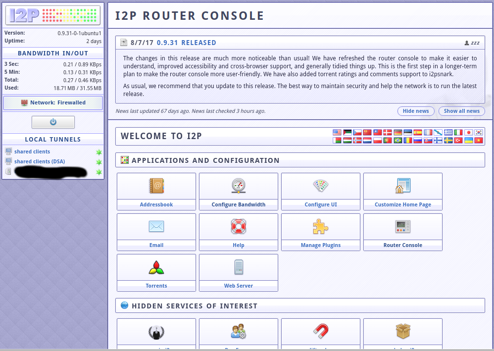
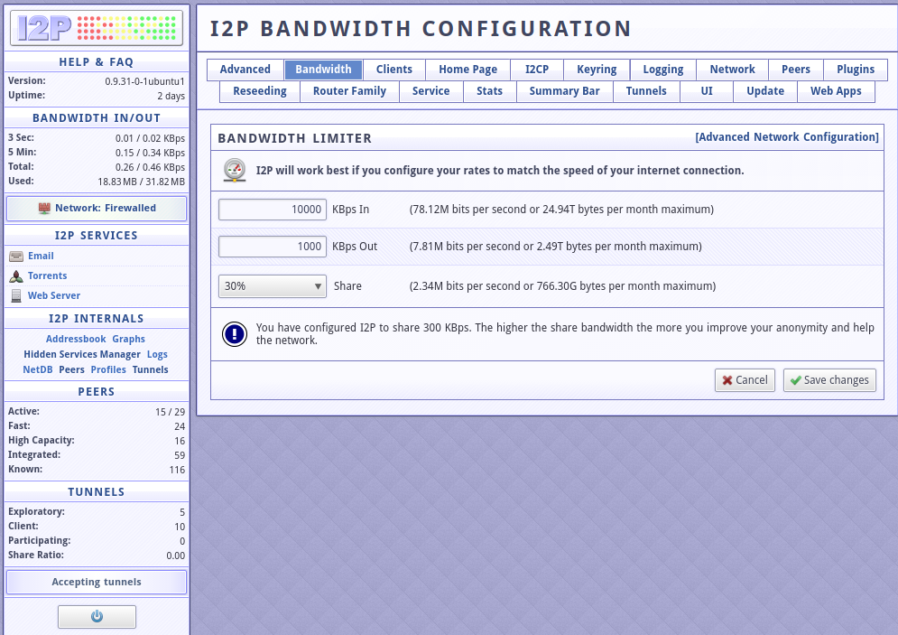
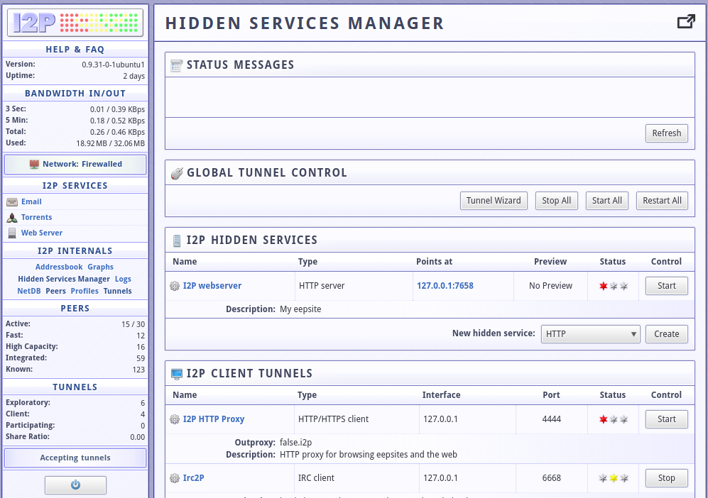
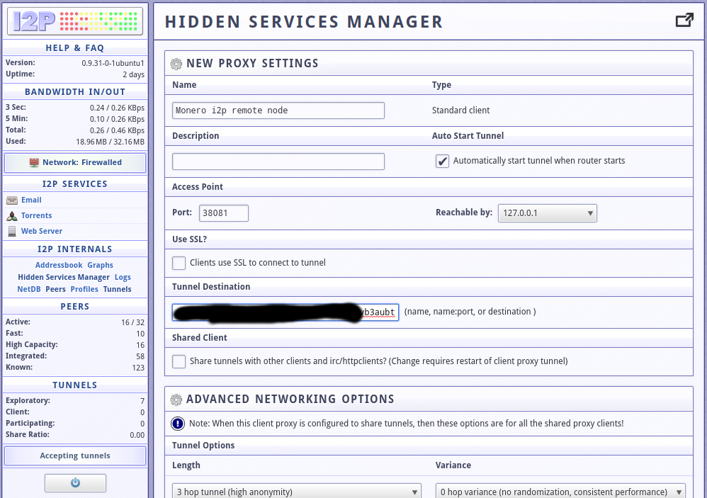
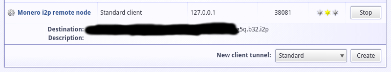
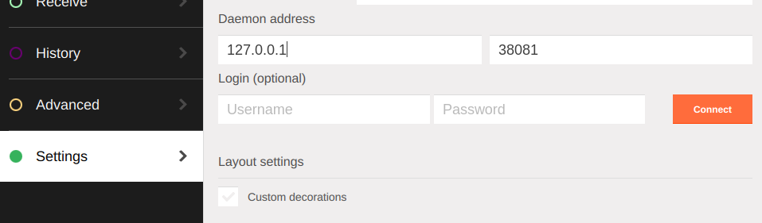

# How to setup i2p for clients and servers

This guide was created after a user on the Monero subreddit asked if there is a way to use i2p for Monero now, before Kovri becomes available. The answer is obviously yes but I found the current i2p guides somewhat lacking so I decided to create a new one.

The instructions contained herein are for setting up a Monero i2p connection from both the client side and the server side.

It is worth setting up a docker container for i2p, details for a remote server setup are provided [here](./docker/README.md).

## i2p client setup

First, someone needs to go into a lot of trouble to setup a Monero daemon accessible via i2p (and possibly over regular internet too, known as clearnet in i2p parlance). All they need to provide for clients to connect to their daemon is an i2p address that looks like this:

`5hjjad73re6cyrrt7ulub4x4g3k44zxpamvvt6lv7f5he5khd5za.b32.i2p`

For Monero, there is a (currently short) list of daemons that allow access over i2p found at https://moneroworld.com/#nodes (section "Hidden Nodes"). Pick one of them.

Next step is to install i2p on your computer. There is very detailed information on the i2p site for various operating systems on how to setup i2p at https://geti2p.net/en/download. 

Once i2p installation is finished, a web management interface is made available at http://localhost:7657.

The first thing one should do is select "Configure bandwidth" and decide how much bandwidth to assign to i2p. This is especially important for metered connections such as 3G. Don't forget to click "Save changes"!

From the bandwidth config page, click on "Hidden Services Manager" (near middle of the sidebar) to go to the i2p tunnel configuration page, where we will create the connection to the remote i2p node.

At the bottom of the page, there is a "New client tunnel" option. Choose "Standard" which means a standard TCP connection to a remote server and click on "Create".

The fields that need to be changed are:

* **Name**: Give a nice, reasonable name
* **Auto Start Tunnel**: Check this to have the client connection start (and stop) with the i2p service
* **Port**: A local TCP port on your computer. 38081 is as good number as any.
* **Reachable by**: Select 127.0.0.1 here. This IP address alongside with the port (127.0.0.1:38081) are to be entered to the wallet settings.
* **Tunnel Destination**: Enter the i2p address previously selected from the list of nodes.

Leave all the other options at their default settings and click "Save" at the bottom. You will be taken back to the i2p tunnel manager screen and the newly created client entry will be at the bottom of the page.

The yellow star indication means that the entry was created successfully and is waiting to accept connections from the wallet.

To use this from the monero cli client, use the following incantation:

`monero-wallet-cli --daemon-address 127.0.0.1:38081`

To use this from monero GUI, click on Settings and provide the "Daemon address" host and port:

