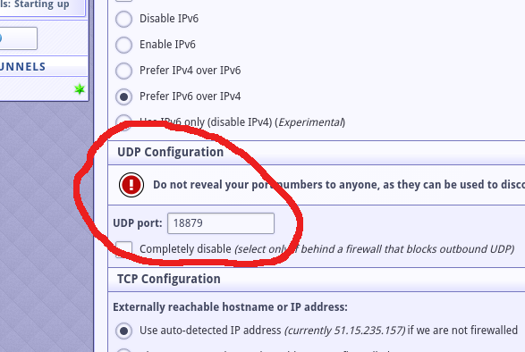
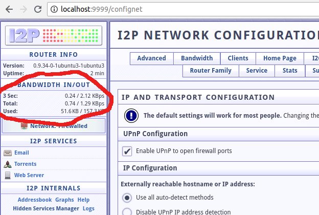
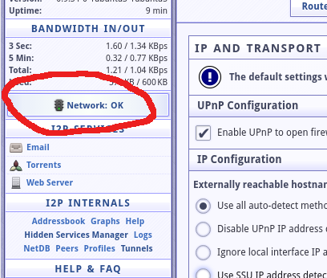

# dockerized i2p setup

We assume that the host system is linux based, with the i2p container using a recent ubuntu version (18.04 at this time, version shortened and suitable for container deployment). We also assume that the host has a public IP address and is reachable from the rest of the internet, this is important for incoming i2p connections.

The setup described here is a "server" version of i2p, however i2p (i2p-router) is always running in a hybrid server-client mode so the setup is also useful for client i2p setups. SSH root/sudo access is of course necessary for anything docker-related.

The process described here also assumes that the container is being setup on a remote system.

The main benefits of using docker for i2p:

- i2p is isolated from the rest of the system, adding an extra layer of security
- the host system setup remains clean and unaffected, removing i2p is as simple as removing the container

## preparation

Actions described below will be alternating between remote server and local actions.

#### local terminal

- login to the remote server using SSH (and either root or a sudo account, the following are examples):

        ssh ubuntu@my-remote-server.net

#### remote server

- clone this repo locally on the destination server (the only files really needed are `Dockerfile` and `i2prouter-nowrapper-phusion`):

        git clone git@github.com:tioann/i2psetup-monero.git

- create the primordial `i2p-router` image:

        cd i2psetup-monero/docker
        sudo docker build -t i2p-router .

    The newly created image contains an unconfigured i2p router. The main differences with a configured i2p router is a unique id and the UDP port used for incoming connections.

- start a container for i2p, this will perform all necessary configuration automatically:

        sudo docker run -d --name i2p-tmp i2p-router

    after a few minutes the i2p service should be up and running.

- the container is using the default bridge networking, for which we retrieve the container local IP address (typically 172.17.0.2 for the first container):

        sudo docker inspect i2p-tmp | grep IPAddress

- disconnect from the remote server

        exit

#### local terminal

- login again to the remote server using SSH but also add port forwarding to enable i2p console access:

        ssh -L 9999:172.17.0.2:7657 ubuntu@my-remote-server.net

- connect to the i2p console by opening a browser session to `http://localhost:9999`, the i2p console should now be fully accessible

- go to the `Network` tab (or jump to `http://localhost:9999/confignet`) and check the UDP port in the `UDP Configuration` section. This is the UDP port for incoming connections, keep a note of the value.

- it may be necessary to wait for a bit before the console becomes available and the server is properly configured. Check the `BANDWIDTH IN/OUT` area for some traffic to show up.

#### remote server

- using the existing SSH connection we create a persistent image with the current configuration (and UDP port):

        sudo docker stop i2p-tmp
        sudo docker commit i2p-tmp i2p-xxx
        sudo docker rm i2p-tmp

    where `xxx` is the UDP port number (19024). Any name would work here but I prefer to have the port in the name as an indication that the image is configured and ready to use as well as the proper port mappings to use. We also destroy the temporary container, we will be using a new one with the new image.
    
- start the container with the configured i2p setup and proper port mappings (`xxx` needs to be replaced with the UDP port number):

        sudo docker run --name i2p-xxx -d -p 0.0.0.0:xxx:xxx/udp i2p-xxx

    We name the container with the same name as the image, we should only be running a single container with the same i2p configuration and the convention helps.

#### local terminal

- check that the i2p console is still working properly. It may be a couple of minutes before the new i2p service becomes available. Verify that the network is no longer firewalled:

The i2p docker container is now fully available for further customization. 

## notes

- the container can be used to offer both client and server i2p connections. When specifying offered services remember to bind to the ports on the host using the container gateway IP, which can be found using this command (running on the host):

        docker inspect i2p-xxx | grep Gateway

    Of course, this only works for host services, like monerod, that are not bound solely to the loopback interface (127.0.0.1).
    